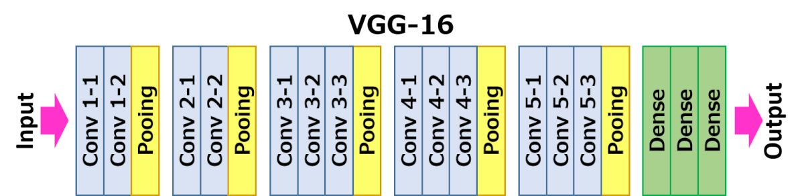
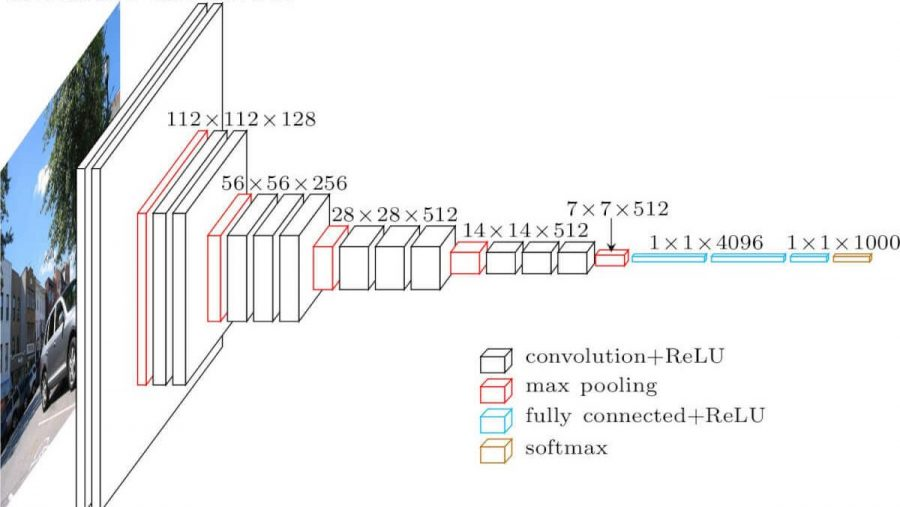

# प्रसिद्ध CNN आर्किटेक्चर

### VGG-16

VGG-16 एक नेटवर्क है जिसने 2014 में ImageNet टॉप-5 क्लासिफिकेशन में 92.7% सटीकता हासिल की। इसका लेयर स्ट्रक्चर निम्नलिखित है:

जैसा कि आप देख सकते हैं, VGG एक पारंपरिक पिरामिड आर्किटेक्चर का अनुसरण करता है, जो कि कॉन्वोल्यूशन-पूलिंग लेयर्स का अनुक्रम है।

> चित्र [Researchgate](https://www.researchgate.net/figure/Vgg16-model-structure-To-get-the-VGG-NIN-model-we-replace-the-2-nd-4-th-6-th-7-th_fig2_335194493) से लिया गया है

### ResNet

ResNet माइक्रोसॉफ्ट रिसर्च द्वारा 2015 में प्रस्तावित मॉडल्स का एक परिवार है। ResNet का मुख्य विचार **रेजिडुअल ब्लॉक्स** का उपयोग करना है:

> चित्र [इस पेपर](https://arxiv.org/pdf/1512.03385.pdf) से लिया गया है

रेजिडुअल ब्लॉक्स का उपयोग करने का कारण यह है कि हमारी लेयर पिछले लेयर के परिणाम और रेजिडुअल ब्लॉक के आउटपुट के बीच **अंतर** की भविष्यवाणी करे - इसी वजह से इसे *रेजिडुअल* कहा जाता है। ये ब्लॉक्स ट्रेन करना बहुत आसान होते हैं, और इनका उपयोग करके सैकड़ों ब्लॉक्स वाले नेटवर्क बनाए जा सकते हैं (सबसे सामान्य वेरिएंट्स हैं ResNet-52, ResNet-101 और ResNet-152)।

आप इस नेटवर्क को ऐसा भी समझ सकते हैं कि यह अपने जटिलता स्तर को डेटा सेट के अनुसार समायोजित कर सकता है। शुरुआत में, जब आप नेटवर्क को ट्रेन करना शुरू करते हैं, तो वेट्स के मान छोटे होते हैं, और अधिकांश सिग्नल पासथ्रू आइडेंटिटी लेयर्स से गुजरता है। जैसे-जैसे ट्रेनिंग आगे बढ़ती है और वेट्स बड़े होते जाते हैं, नेटवर्क पैरामीटर्स का महत्व बढ़ता है, और नेटवर्क आवश्यक अभिव्यक्ति शक्ति को समायोजित करता है ताकि ट्रेनिंग इमेजेस को सही तरीके से वर्गीकृत किया जा सके।

### Google Inception

Google Inception आर्किटेक्चर इस विचार को एक कदम आगे ले जाता है और प्रत्येक नेटवर्क लेयर को कई अलग-अलग पाथ्स के संयोजन के रूप में बनाता है:

> चित्र [Researchgate](https://www.researchgate.net/figure/Inception-module-with-dimension-reductions-left-and-schema-for-Inception-ResNet-v1_fig2_355547454) से लिया गया है

यहां, हमें 1x1 कॉन्वोल्यूशन्स की भूमिका पर जोर देना होगा, क्योंकि शुरुआत में यह समझ में नहीं आता। हम 1x1 फिल्टर के साथ इमेज पर क्यों चलेंगे? हालांकि, आपको याद रखना होगा कि कॉन्वोल्यूशन फिल्टर्स कई डेप्थ चैनल्स (मूल रूप से - RGB कलर्स, और बाद की लेयर्स में - विभिन्न फिल्टर्स के चैनल्स) के साथ काम करते हैं, और 1x1 कॉन्वोल्यूशन का उपयोग इन इनपुट चैनल्स को अलग-अलग ट्रेन करने योग्य वेट्स के साथ मिलाने के लिए किया जाता है। इसे चैनल डायमेंशन पर डाउनसैंपलिंग (पूलिंग) के रूप में भी देखा जा सकता है।

इस विषय पर [एक अच्छा ब्लॉग पोस्ट](https://medium.com/analytics-vidhya/talented-mr-1x1-comprehensive-look-at-1x1-convolution-in-deep-learning-f6b355825578) और [मूल पेपर](https://arxiv.org/pdf/1312.4400.pdf) यहां उपलब्ध है।

### MobileNet

MobileNet छोटे आकार वाले मॉडल्स का एक परिवार है, जो मोबाइल डिवाइस के लिए उपयुक्त है। इन्हें तब उपयोग करें जब आपके पास सीमित संसाधन हों और आप थोड़ी सटीकता का त्याग कर सकते हों। इनके पीछे मुख्य विचार **डेप्थवाइज सेपरेबल कॉन्वोल्यूशन** है, जो कॉन्वोल्यूशन फिल्टर्स को स्पेशियल कॉन्वोल्यूशन्स और डेप्थ चैनल्स पर 1x1 कॉन्वोल्यूशन के संयोजन के रूप में प्रस्तुत करने की अनुमति देता है। यह पैरामीटर्स की संख्या को काफी हद तक कम कर देता है, जिससे नेटवर्क का आकार छोटा हो जाता है और इसे कम डेटा के साथ ट्रेन करना भी आसान हो जाता है।

MobileNet पर [एक अच्छा ब्लॉग पोस्ट](https://medium.com/analytics-vidhya/image-classification-with-mobilenet-cc6fbb2cd470) यहां उपलब्ध है।

## निष्कर्ष

इस यूनिट में, आपने कंप्यूटर विज़न न्यूरल नेटवर्क्स के पीछे मुख्य अवधारणा - कॉन्वोल्यूशनल नेटवर्क्स - के बारे में सीखा। इमेज क्लासिफिकेशन, ऑब्जेक्ट डिटेक्शन, और यहां तक कि इमेज जनरेशन नेटवर्क्स को शक्ति प्रदान करने वाले वास्तविक जीवन के आर्किटेक्चर सभी CNNs पर आधारित हैं, बस अधिक लेयर्स और कुछ अतिरिक्त ट्रेनिंग ट्रिक्स के साथ।

## 🚀 चुनौती

साथ में दिए गए नोटबुक्स में, नीचे नोट्स दिए गए हैं कि अधिक सटीकता कैसे प्राप्त की जा सकती है। कुछ प्रयोग करें और देखें कि क्या आप उच्च सटीकता प्राप्त कर सकते हैं।

## [पोस्ट-लेक्चर क्विज़](https://ff-quizzes.netlify.app/en/ai/quiz/14)

## समीक्षा और स्व-अध्ययन

हालांकि CNNs का उपयोग अक्सर कंप्यूटर विज़न कार्यों के लिए किया जाता है, वे आम तौर पर फिक्स्ड-साइज़ पैटर्न निकालने में अच्छे होते हैं। उदाहरण के लिए, यदि हम साउंड्स के साथ काम कर रहे हैं, तो हम ऑडियो सिग्नल में कुछ विशिष्ट पैटर्न खोजने के लिए CNNs का उपयोग करना चाह सकते हैं - इस मामले में फिल्टर्स 1-डायमेंशनल होंगे (और इस CNN को 1D-CNN कहा जाएगा)। इसके अलावा, कभी-कभी 3D-CNN का उपयोग मल्टी-डायमेंशनल स्पेस में फीचर्स निकालने के लिए किया जाता है, जैसे कि वीडियो में कुछ घटनाओं का होना - CNN समय के साथ फीचर्स के बदलने के कुछ पैटर्न को कैप्चर कर सकता है। CNNs के साथ किए जा सकने वाले अन्य कार्यों के बारे में समीक्षा और स्व-अध्ययन करें।

## [असाइनमेंट](lab/README.md)

इस लैब में, आपको विभिन्न बिल्ली और कुत्ते की नस्लों को वर्गीकृत करने का कार्य दिया गया है। ये इमेजेस MNIST डेटा सेट की तुलना में अधिक जटिल और उच्च डायमेंशन वाली हैं, और 10 से अधिक क्लासेस हैं।

---