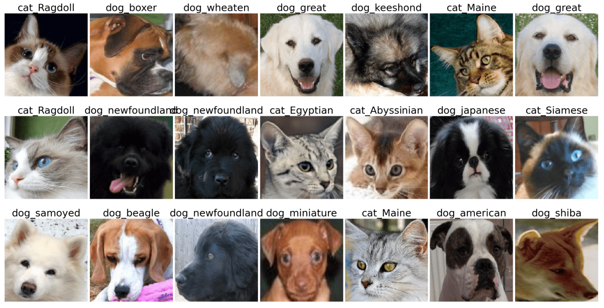

# Classification of Pets Faces

Lab Assignment from [AI for Beginners Curriculum](https://github.com/microsoft/ai-for-beginners).

## Task

Imagine you need to develop and application for pet nursery to catalog all pets. One of the great features of such an application would be automatically discovering the breed from a photograph. This can be successfully done using neural networks.

You need to train a convolutional neural network to classify different breeds of cats and dogs using **Pet Faces** dataset.

## The Dataset

We will use the [Oxford-IIIT Pet Dataset](https://www.robots.ox.ac.uk/~vgg/data/pets/), which contains images of 37 different breeds of dogs and cats.



To download the dataset, use this code snippet:

```python
!wget https://thor.robots.ox.ac.uk/~vgg/data/pets/images.tar.gz
!tar xfz images.tar.gz
!rm images.tar.gz
```

**Note:** The Oxford-IIIT Pet Dataset images are organized by filename (e.g., `Abyssinian_1.jpg`, `Bengal_2.jpg`). The notebook includes code to organize these images into breed-specific subdirectories for easier classification.

## Stating Notebook

Start the lab by opening [PetFaces.ipynb](/notebooks/PetFaces.ipynb)

## Takeaway

You have solved a relatively complex problem of image classification from scratch! There were quite a lot of classes, and you were still able to get reasonable accuracy! It also makes sense to measure top-k accuracy, because it is easy to confuse some of the classes which are not clearly different even to human beings.