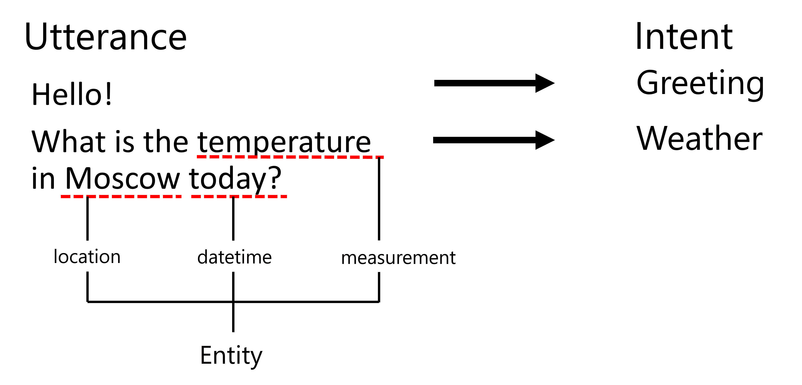
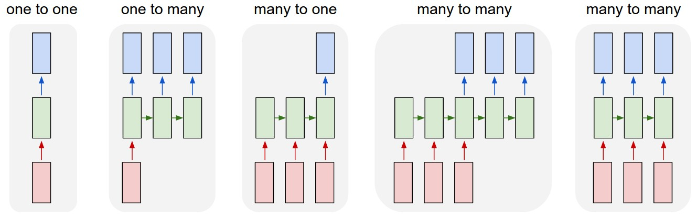

# नामित इकाई पहचान

अब तक, हमने मुख्य रूप से एक NLP कार्य - वर्गीकरण पर ध्यान केंद्रित किया है। हालांकि, तंत्रिका नेटवर्क के साथ अन्य NLP कार्य भी पूरे किए जा सकते हैं। उनमें से एक कार्य है **[नामित इकाई पहचान](https://wikipedia.org/wiki/Named-entity_recognition)** (NER), जो पाठ में विशिष्ट इकाइयों को पहचानने से संबंधित है, जैसे स्थान, व्यक्ति के नाम, तारीख-समय अंतराल, रासायनिक सूत्र आदि।

## [प्री-लेक्चर क्विज़](https://ff-quizzes.netlify.app/en/ai/quiz/37)

## NER का उपयोग करने का उदाहरण

मान लीजिए कि आप एक प्राकृतिक भाषा चैट बॉट विकसित करना चाहते हैं, जैसे Amazon Alexa या Google Assistant। बुद्धिमान चैट बॉट्स इस तरह काम करते हैं कि वे उपयोगकर्ता की बात को *समझते* हैं, इनपुट वाक्य पर टेक्स्ट वर्गीकरण करके। इस वर्गीकरण का परिणाम **इरादा** कहलाता है, जो निर्धारित करता है कि चैट बॉट को क्या करना चाहिए।

> लेखक द्वारा बनाई गई छवि

हालांकि, उपयोगकर्ता वाक्यांश के हिस्से के रूप में कुछ पैरामीटर प्रदान कर सकता है। उदाहरण के लिए, मौसम के बारे में पूछते समय, वह स्थान या तारीख निर्दिष्ट कर सकता है। बॉट को उन इकाइयों को समझने और कार्रवाई करने से पहले पैरामीटर स्लॉट्स को भरने में सक्षम होना चाहिए। यही वह जगह है जहां NER काम आता है।

> ✅ एक और उदाहरण [वैज्ञानिक चिकित्सा पत्रों का विश्लेषण](https://soshnikov.com/science/analyzing-medical-papers-with-azure-and-text-analytics-for-health/) हो सकता है। मुख्य चीजों में से एक जिसे हमें देखना होता है, वह हैं विशिष्ट चिकित्सा शब्द, जैसे बीमारियां और चिकित्सा पदार्थ। जबकि कुछ बीमारियों को शायद सबस्ट्रिंग सर्च का उपयोग करके निकाला जा सकता है, अधिक जटिल इकाइयों, जैसे रासायनिक यौगिक और दवाओं के नाम, के लिए अधिक जटिल दृष्टिकोण की आवश्यकता होती है।

## टोकन वर्गीकरण के रूप में NER

NER मॉडल मूल रूप से **टोकन वर्गीकरण मॉडल** होते हैं, क्योंकि हमें प्रत्येक इनपुट टोकन के लिए यह तय करना होता है कि वह किसी इकाई से संबंधित है या नहीं, और यदि है - तो किस इकाई वर्ग से।

निम्नलिखित पेपर शीर्षक पर विचार करें:

**Tricuspid valve regurgitation** और **lithium carbonate** **toxicity** एक नवजात शिशु में।

यहां इकाइयां हैं:

* Tricuspid valve regurgitation एक बीमारी है (`DIS`)
* Lithium carbonate एक रासायनिक पदार्थ है (`CHEM`)
* Toxicity भी एक बीमारी है (`DIS`)

ध्यान दें कि एक इकाई कई टोकन तक फैली हो सकती है। और, इस मामले में, हमें दो लगातार इकाइयों के बीच अंतर करना होगा। इसलिए, प्रत्येक इकाई के लिए दो वर्गों का उपयोग करना आम है - एक जो इकाई के पहले टोकन को निर्दिष्ट करता है (अक्सर `B-` उपसर्ग का उपयोग किया जाता है, **शुरुआत** के लिए), और दूसरा - इकाई की निरंतरता (`I-`, **आंतरिक टोकन** के लिए)। हम `O` का उपयोग सभी **अन्य** टोकनों को दर्शाने के लिए करते हैं। इस प्रकार के टोकन टैगिंग को [BIO टैगिंग](https://en.wikipedia.org/wiki/Inside%E2%80%93outside%E2%80%93beginning_(tagging)) (या IOB) कहा जाता है। टैगिंग के बाद, हमारा शीर्षक इस प्रकार दिखेगा:

Token | Tag
------|-----
Tricuspid | B-DIS
valve | I-DIS
regurgitation | I-DIS
and | O
lithium | B-CHEM
carbonate | I-CHEM
toxicity | B-DIS
in | O
a | O
newborn | O
infant | O
. | O

चूंकि हमें टोकन और वर्गों के बीच एक-से-एक पत्राचार बनाना है, हम इस चित्र से एक सही **कई-से-कई** तंत्रिका नेटवर्क मॉडल को प्रशिक्षित कर सकते हैं:

> *[Andrej Karpathy](http://karpathy.github.io/) द्वारा [इस ब्लॉग पोस्ट](http://karpathy.github.io/2015/05/21/rnn-effectiveness/) से छवि। NER टोकन वर्गीकरण मॉडल इस चित्र में सबसे दाईं ओर नेटवर्क आर्किटेक्चर से मेल खाते हैं।*

## NER मॉडल को प्रशिक्षित करना

चूंकि NER मॉडल मूल रूप से एक टोकन वर्गीकरण मॉडल है, हम इस कार्य के लिए RNN का उपयोग कर सकते हैं, जिनसे हम पहले ही परिचित हैं। इस मामले में, पुनरावर्ती नेटवर्क का प्रत्येक ब्लॉक टोकन ID लौटाएगा। निम्नलिखित उदाहरण नोटबुक दिखाता है कि टोकन वर्गीकरण के लिए LSTM को कैसे प्रशिक्षित किया जाए।

## ✍️ उदाहरण नोटबुक्स: NER

निम्नलिखित नोटबुक में अपनी सीख जारी रखें:

* [TensorFlow के साथ NER](/notebooks/NER-TF.ipynb)

## निष्कर्ष

एक NER मॉडल एक **टोकन वर्गीकरण मॉडल** है, जिसका अर्थ है कि इसे टोकन वर्गीकरण करने के लिए उपयोग किया जा सकता है। यह NLP में एक बहुत ही सामान्य कार्य है, जो पाठ में विशिष्ट इकाइयों को पहचानने में मदद करता है, जैसे स्थान, नाम, तारीखें और अधिक।

## 🚀 चुनौती

नीचे दिए गए असाइनमेंट को पूरा करें ताकि चिकित्सा शब्दों के लिए एक नामित इकाई पहचान मॉडल प्रशिक्षित किया जा सके, फिर इसे एक अलग डेटासेट पर आज़माएं।

## [पोस्ट-लेक्चर क्विज़](https://ff-quizzes.netlify.app/en/ai/quiz/38)

## समीक्षा और स्व-अध्ययन

ब्लॉग [The Unreasonable Effectiveness of Recurrent Neural Networks](http://karpathy.github.io/2015/05/21/rnn-effectiveness/) को पढ़ें और उस लेख के Further Reading सेक्शन के साथ आगे बढ़ें ताकि अपने ज्ञान को गहरा कर सकें।

## [असाइनमेंट](lab/README.md)

इस पाठ के असाइनमेंट में, आपको एक चिकित्सा इकाई पहचान मॉडल को प्रशिक्षित करना होगा। आप इस पाठ में वर्णित LSTM मॉडल को प्रशिक्षित करने से शुरू कर सकते हैं और फिर BERT ट्रांसफॉर्मर मॉडल का उपयोग कर सकते हैं। सभी विवरण प्राप्त करने के लिए [निर्देश](lab/README.md) पढ़ें।

---