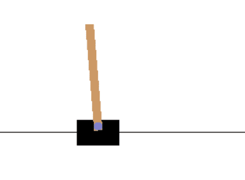
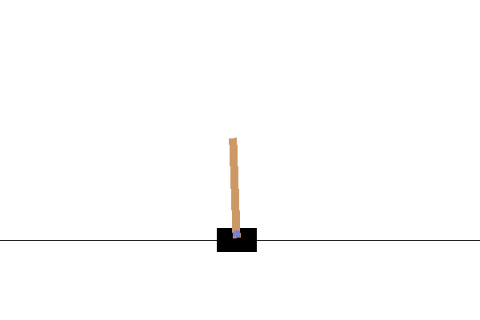

# التعلم العميق بالتعزيز

يُعتبر التعلم بالتعزيز (RL) أحد الأسس الرئيسية لنماذج التعلم الآلي، إلى جانب التعلم الموجّه والتعلم غير الموجّه. بينما يعتمد التعلم الموجّه على مجموعة بيانات تحتوي على نتائج معروفة، فإن التعلم بالتعزيز يعتمد على **التعلم من خلال التجربة**. على سبيل المثال، عندما نرى لعبة فيديو لأول مرة، نبدأ باللعب دون معرفة القواعد، وسرعان ما نتمكن من تحسين مهاراتنا فقط من خلال عملية اللعب وتعديل سلوكنا.

## [اختبار ما قبل المحاضرة](https://ff-quizzes.netlify.app/en/ai/quiz/43)

لإجراء التعلم بالتعزيز، نحتاج إلى:

* **بيئة** أو **محاكي** يحدد قواعد اللعبة. يجب أن نتمكن من إجراء التجارب في المحاكي ومراقبة النتائج.
* **دالة المكافأة** التي تشير إلى مدى نجاح تجربتنا. في حالة تعلم لعب لعبة فيديو، ستكون المكافأة هي النتيجة النهائية التي نحققها.

بناءً على دالة المكافأة، يجب أن نتمكن من تعديل سلوكنا وتحسين مهاراتنا، بحيث نلعب بشكل أفضل في المرة القادمة. الفرق الرئيسي بين التعلم بالتعزيز وأنواع التعلم الأخرى هو أننا عادةً لا نعرف ما إذا كنا سنفوز أو نخسر حتى ننهي اللعبة. وبالتالي، لا يمكننا تحديد ما إذا كانت حركة معينة جيدة أو لا - نحصل فقط على المكافأة في نهاية اللعبة.

خلال التعلم بالتعزيز، نقوم عادةً بإجراء العديد من التجارب. في كل تجربة، نحتاج إلى تحقيق توازن بين اتباع الاستراتيجية المثلى التي تعلمناها حتى الآن (**الاستغلال**) واستكشاف حالات جديدة محتملة (**الاستكشاف**).

## OpenAI Gym

أداة رائعة للتعلم بالتعزيز هي [OpenAI Gym](https://gym.openai.com/) - وهي **بيئة محاكاة** يمكنها محاكاة العديد من البيئات المختلفة بدءًا من ألعاب Atari إلى الفيزياء وراء توازن الأعمدة. تُعتبر واحدة من أكثر بيئات المحاكاة شيوعًا لتدريب خوارزميات التعلم بالتعزيز، ويتم صيانتها بواسطة [OpenAI](https://openai.com/).

> **ملاحظة**: يمكنك الاطلاع على جميع البيئات المتاحة من OpenAI Gym [هنا](https://gym.openai.com/envs/#classic_control).

## توازن CartPole

ربما رأيتم جميعًا أجهزة التوازن الحديثة مثل *Segway* أو *Gyroscooters*. هذه الأجهزة قادرة على التوازن تلقائيًا من خلال تعديل عجلاتها استجابةً للإشارات القادمة من مقياس التسارع أو الجيروسكوب. في هذا القسم، سنتعلم كيفية حل مشكلة مشابهة - توازن عمود. يشبه ذلك الوضع عندما يحتاج لاعب سيرك إلى توازن عمود على يده - لكن هذا التوازن يحدث فقط في بعد واحد.

نسخة مبسطة من التوازن تُعرف بمشكلة **CartPole**. في عالم CartPole، لدينا منزلق أفقي يمكنه التحرك يمينًا أو يسارًا، والهدف هو توازن عمود عمودي فوق المنزلق أثناء تحركه.



لإنشاء واستخدام هذه البيئة، نحتاج إلى بضعة أسطر من كود Python:

```python
import gym
env = gym.make("CartPole-v1")

env.reset()
done = False
total_reward = 0
while not done:
   env.render()
   action = env.action_space.sample()
   observaton, reward, done, info = env.step(action)
   total_reward += reward

print(f"Total reward: {total_reward}")
```

يمكن الوصول إلى كل بيئة بنفس الطريقة:
* `env.reset` يبدأ تجربة جديدة
* `env.step` ينفذ خطوة محاكاة. يتلقى **إجراء** من **مساحة الإجراءات**، ويعيد **ملاحظة** (من مساحة الملاحظات)، بالإضافة إلى مكافأة وعلامة انتهاء.

في المثال أعلاه، نقوم بتنفيذ إجراء عشوائي في كل خطوة، ولهذا السبب تكون حياة التجربة قصيرة جدًا:



هدف خوارزمية التعلم بالتعزيز هو تدريب نموذج - ما يُعرف بـ **السياسة** &pi; - التي ستعيد الإجراء استجابةً لحالة معينة. يمكننا أيضًا اعتبار السياسة احتمالية، أي أنه لكل حالة *s* وإجراء *a* ستعيد السياسة الاحتمال &pi;(*a*|*s*) الذي يجب أن نتخذ فيه الإجراء *a* في الحالة *s*.

## خوارزمية Policy Gradients

الطريقة الأكثر وضوحًا لنمذجة السياسة هي إنشاء شبكة عصبية تأخذ الحالات كمدخلات وتعيد الإجراءات المقابلة (أو بالأحرى احتمالات جميع الإجراءات). بمعنى ما، ستكون مشابهة لمهمة تصنيف عادية، مع فرق رئيسي - نحن لا نعرف مسبقًا أي الإجراءات يجب أن نتخذها في كل خطوة.

الفكرة هنا هي تقدير تلك الاحتمالات. نبني متجهًا من **المكافآت التراكمية** التي تُظهر إجمالي المكافأة في كل خطوة من التجربة. كما نطبق **خصم المكافآت** بضرب المكافآت السابقة بمعامل &gamma;=0.99، لتقليل دور المكافآت السابقة. ثم نقوم بتعزيز تلك الخطوات على طول مسار التجربة التي تحقق مكافآت أكبر.

> تعرف على المزيد حول خوارزمية Policy Gradient وشاهدها عمليًا في [دفتر المثال](/notebooks/CartPole-RL-TF.ipynb).

## خوارزمية Actor-Critic

نسخة محسّنة من نهج Policy Gradients تُعرف بـ **Actor-Critic**. الفكرة الرئيسية وراءها هي أن الشبكة العصبية ستُدرّب لإعادة شيئين:

* السياسة، التي تحدد الإجراء الذي يجب اتخاذه. يُطلق على هذا الجزء **الممثل**
* تقدير إجمالي المكافأة التي يمكننا توقع الحصول عليها في هذه الحالة - يُطلق على هذا الجزء **الناقد**.

بمعنى ما، تشبه هذه البنية [GAN](../../4-ComputerVision/10-GANs/README.md)، حيث لدينا شبكتان يتم تدريبهما ضد بعضهما البعض. في نموذج Actor-Critic، يقترح الممثل الإجراء الذي يجب اتخاذه، ويحاول الناقد أن يكون ناقدًا ويقدر النتيجة. ومع ذلك، هدفنا هو تدريب تلك الشبكات معًا.

نظرًا لأننا نعرف كل من المكافآت التراكمية الحقيقية والنتائج التي يعيدها الناقد أثناء التجربة، فمن السهل نسبيًا بناء دالة خسارة تقلل الفرق بينهما. سيعطينا ذلك **خسارة الناقد**. يمكننا حساب **خسارة الممثل** باستخدام نفس النهج كما في خوارزمية Policy Gradient.

بعد تشغيل إحدى هذه الخوارزميات، يمكننا توقع أن يتصرف CartPole لدينا بهذا الشكل:


## ✍️ تمارين: Policy Gradients و Actor-Critic RL

واصل تعلمك في الدفاتر التالية:

* [التعلم بالتعزيز باستخدام TensorFlow](/notebooks/CartPole-RL-TF.ipynb)
* [التعلم بالتعزيز باستخدام PyTorch](/notebooks/CartPole-RL-PyTorch.ipynb)

## مهام أخرى للتعلم بالتعزيز

يُعتبر التعلم بالتعزيز اليوم مجالًا سريع النمو في البحث. بعض الأمثلة المثيرة للاهتمام للتعلم بالتعزيز تشمل:

* تعليم الكمبيوتر لعب **ألعاب Atari**. الجزء الصعب في هذه المشكلة هو أننا لا نملك حالة بسيطة ممثلة كمتجه، بل لقطة شاشة - ونحتاج إلى استخدام CNN لتحويل صورة الشاشة إلى متجه ميزات أو لاستخراج معلومات المكافأة. ألعاب Atari متوفرة في Gym.
* تعليم الكمبيوتر لعب ألعاب الطاولة، مثل الشطرنج وGo. مؤخرًا، تم تدريب برامج متقدمة مثل **Alpha Zero** من الصفر بواسطة وكيلين يلعبان ضد بعضهما البعض ويتحسنان في كل خطوة.
* في الصناعة، يُستخدم التعلم بالتعزيز لإنشاء أنظمة التحكم من المحاكاة. خدمة تُسمى [Bonsai](https://azure.microsoft.com/services/project-bonsai/?WT.mc_id=academic-77998-cacaste) مصممة خصيصًا لهذا الغرض.

## الخاتمة

لقد تعلمنا الآن كيفية تدريب الوكلاء لتحقيق نتائج جيدة فقط من خلال توفير دالة مكافأة تحدد الحالة المرغوبة للعبة، ومنحهم فرصة لاستكشاف مساحة البحث بذكاء. لقد جربنا بنجاح خوارزميتين، وحققنا نتيجة جيدة في فترة زمنية قصيرة نسبيًا. ومع ذلك، هذه مجرد بداية رحلتك في التعلم بالتعزيز، ويجب أن تفكر بالتأكيد في أخذ دورة منفصلة إذا كنت ترغب في التعمق أكثر.

## 🚀 التحدي

استكشف التطبيقات المدرجة في قسم "مهام أخرى للتعلم بالتعزيز" وحاول تنفيذ أحدها!

## [اختبار ما بعد المحاضرة](https://ff-quizzes.netlify.app/en/ai/quiz/44)

## المراجعة والدراسة الذاتية

تعرف على المزيد حول التعلم بالتعزيز الكلاسيكي في [منهج تعلم الآلة للمبتدئين](https://github.com/microsoft/ML-For-Beginners/blob/main/8-Reinforcement/README.md).

شاهد [هذا الفيديو الرائع](https://www.youtube.com/watch?v=qv6UVOQ0F44) الذي يتحدث عن كيفية تعلم الكمبيوتر لعب لعبة سوبر ماريو.

## المهمة: [تدريب سيارة جبلية](lab/README.md)

هدفك خلال هذه المهمة هو تدريب بيئة Gym مختلفة - [Mountain Car](https://www.gymlibrary.ml/environments/classic_control/mountain_car/).

---